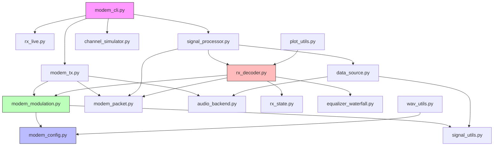

# Acoustic Modem — Документация реализации

## Обзор

Акустический модем для передачи данных через звуковой канал (динамик → микрофон) с использованием OFDM модуляции. Работает на частоте дискретизации 48 кГц, полоса 375–4875 Гц, 49 поднесущих (48 данных + 1 пилот).

Поддерживает два типа **дифференциальной** модуляции: **DQPSK** (2 бита/поднесущую) и **DBPSK** (1 бит/поднесущую). Передача пакетная с преамбулами, пилотными символами, интерливингом, кодированием Рида-Соломона и CRC32.

**Дифференциальная модуляция (DQPSK/DBPSK):**
- Пилот-поднесущая (индекс 24, середина спектра) — точка отсчёта фазы. Всегда передаётся символ с фазой 0 (1+0j).
- Фаза соседних поднесущих кодируется относительно пилота в зависимости от данных.
- Порядок кодирования: пилот (24) → 23 → 25 → 22 → 26 → 21 → 27 → ... → 0 → 48
- Каждый следующий символ кодируется относительно предыдущего: 
- В каждом новом OFDM символе всё начинается заново — пилот снова передаётся как известный символ.
- Цель: избавиться от необходимости оценки канала.

**Пилот-поднесущая:** Поднесущая с индексом 24 (25-я по счёту) — опорная точка для дифференциального кодирования. В преамбуле она не используется (тишина), в данных передаётся символ 1+0j (фаза 0).

---

## Архитектура (Mermaid)



---

## Структура модулей

### 1. modem_config.py — Конфигурация системы

**Назначение:** Все параметры OFDM, RS-кода, AGC, пилотов, фаз.

**Ключевые параметры:**
| Параметр | Значение | Описание |
|----------|----------|----------|
| `fs` | 48000 | Частота дискретизации |
| `Nfft` | 512 | Размер FFT |
| `Ncp` | 128 | Длина циклического префикса |
| `Nsub` | 49 | Количество поднесущих (48 данных + 1 пилот) |
| `DATA_SUBC_COUNT` | 48 | Количество поднесущих, несущих данные |
| `PILOT_SUBC_INDEX` | 24 | Индекс пилот-поднесущей (0-based, 25-я по счёту) |
| `PILOT_SUBC_FD_BIN` | subc_inds[24] | FFT-бин пилот-поднесущей |
| `SYMBOL_LEN` | 640 | Длина OFDM символа (Nfft + Ncp) |
| `RS_DATA_BYTES` | 8 | Байт данных в RS-слове |
| `RS_PARITY_BYTES` | 4 | Байт чётности в RS-слове |
| `RS_CW_BITS` | 96 | Бит в RS кодовом слове |
| `PREAMBLE_PILOT_SYMBOLS` | 16 | Пилотных символов перед преамбулой (только пакет 0) |
| `MODULATION` | "QPSK" | Текущая модуляция |

**Частотный диапазон:**
- `df = fs/Nfft = 93.75 Гц`
- `k_low = 4` → `f_low = 375 Гц`
- `k_high = 52` → `f_high = 4875 Гц`
- Пилот-поднесущая: `subc_inds[24]` → `freq = subc_inds[24] * 93.75 Гц`

**Функции:**
- `set_modulation(type)` — переключение DQPSK/DBPSK, пересчёт `BITS_PER_SYMBOL`, `OFDM_SYMBOLS_PER_BLOCK`, `BITS_PER_OFDM_SYMBOL`
- `init_phases()` — инициализация фаз поднесущих (Schroeder/Habr/random)
- `make_subcarrier_phases(method, N, seed)` — генерация фаз

**Логика DQPSK vs DBPSK:**
- DQPSK: `BITS_PER_SYMBOL=2`, `OFDM_SYMBOLS_PER_BLOCK=1` (1 OFDM символ = 96 бит = 1 RS слово)
- DBPSK: `BITS_PER_SYMBOL=1`, `OFDM_SYMBOLS_PER_BLOCK=2` (2 OFDM символа = 96 бит = 1 RS слово)

**BITS_PER_OFDM_SYMBOL** рассчитывается как `DATA_SUBC_COUNT * BITS_PER_SYMBOL` (не `Nsub * BITS_PER_SYMBOL`), т.к. пилот-поднесущая не несёт данных.

---

### 2. modem_modulation.py — Модуляция и демодуляция

**Назначение:** Преобразование битов в OFDM-символы и обратно. Поддерживает **когерентную** (QPSK/BPSK) и **дифференциальную** (DQPSK/DBPSK) модуляцию.

**Цепочка передачи (TX):**
```
байты → RS-кодирование → биты → интерливинг → DQPSK/DBPSK маппинг → OFDM символы
```

**Цепочка приёма (RX):**
```
OFDM символы → FFT → дифференциальное декодирование → деинтерливинг → RS-декодирование → байты
```

**Ключевые функции:**

#### Дифференциальный маппинг:
- `dqpsk_map(bits)` — биты → DQPSK символы (дифференциальное кодирование)
  - Биты '00' → Δφ = 0, '01' → Δφ = π/2, '11' → Δφ = π, '10' → Δφ = -π/2
- `dbpsk_map(bits)` — биты → DBPSK символы (дифференциальное кодирование)
  - Бит '0' → Δφ = 0, '1' → Δφ = π
- `dqpsk_demap(syms, pilot_phase)` — DQPSK символы → биты (сравнение фаз с пилотом)
- `dbpsk_demap(syms, pilot_phase)` — DBPSK символы → биты (сравнение фаз с пилотом)

#### Порядок дифференциального кодирования (от пилота к краям):
```
Пилот (индекс 24) → точка отсчёта, фаза = 0
Порядок: 23 → 25 → 22 → 26 → 21 → 27 → ... → 0 → 48
Каждый символ: symbol[k] = symbol[k-1] * exp(j * Δφ_data)
```

#### Интерливинг:
- `interleave_bits(bits, block_size=96)` — блочный интерливинг: запись по строкам, чтение по столбцам (матрица 8×N)
- `deinterleave_bits(bits, block_size=96)` — обратная операция

#### OFDM:
- `ofdm_symbol(data_syms, return_fd=False, is_preamble=False)` — сборка OFDM символа: нормализация → ACE → фазы → IFFT → CP. Для DQPSK/DBPSK пилот-поднесущая уже установлена в build_data_td.
- `build_data_td(bits, collect_fd=False)` — модуляция потока битов в сигнал во временной области. Применяет дифференциальное кодирование в порядке от пилота к краям.
- `build_preamble(reps=1, zc_root=1)` — преамбула: ZC + ZC + Pilot + Pilot (4 OFDM символа). ZC и Pilot заполняют 48 поднесущих, пропуская пилот-поднесущую.

#### ACE (Active Constellation Extension):
- `ace_reduce_peaks(ds, Nfft, subc_inds)` — снижение PAPR методом ACE (до 5 итераций). Пилот-поднесущая не затрагивается ACE.

#### Преамбула:
Структура: `[ZC_seq | ZC_seq | Pilot | Pilot]`
- ZC (Zadoff-Chu): корень 1, длина 48 (DATA_SUBC_COUNT), размещены на поднесущих `subc_inds` с пропуском пилот-поднесущей
- Pilot: 48 поднесущих = (1+j)/√2, пилот-поднесущая = 0

#### Пилот-поднесущая в данных:
- В каждом OFDM символе данных поднесущая с индексом `PILOT_SUBC_INDEX` содержит символ 1+0j (фаза 0)
- Это точка отсчёта для дифференциального декодирования
- ACE не изменяет значение пилот-поднесущей

#### AdaptiveEqualizer — адаптивный эквалайзер:
- В настоящее время **отключён** (EQUALIZER_ENABLED=False)
- Дифференциальная модуляция позволяет обойтись без оценки канала

---

### 3. modem_tx.py — Передача

**Назначение:** Сборка пакетов, вставка пилотов, мягкий клиппинг, сохранение/воспроизведение.

**Структура пакета:**
```
[pilots(16)] [preamble(ZC+ZC+P+P)] [data] [gap]
```
- Пилоты перед преамбулой — только для пакета 0
- Пилот-поднесущая в пилотных символах перед преамбулой = символ "0" (как в данных)

**Функции:**
- `transmit_text(text)` — передача текста
- `transmit_file(file_path)` — передача файла
- `_transmit_data(data_bytes, ...)` — внутренняя функция: разбивка на пакеты, RS, модуляция, клиппинг
- `_generate_pilot_symbols(n)` — генерация пилотных OFDM символов (перед преамбулой пакета 0). Пилот-поднесущая = символ "0".
- `softclip_tanh(x, g)` — мягкий клиппинг через tanh
- `apply_softclip_to_target_crest(x, target_db=6)` — клиппинг до целевого PAPR (6 дБ)

**Алгоритм передачи:**
1. Формирование заголовка (64 байта, один раз для первого пакета)
2. Бинарный поиск максимального payload, влезающего в N логических блоков
3. RS-кодирование (8 данных + 4 чётности = 12 байт = 96 бит)
4. Интерливинг
5. BPSK/QPSK модуляция (данные на 48 поднесущих)
6. OFDM модуляция (пилот-поднесущая заполняется автоматически)
7. Добавление преамбулы и gap-шума
8. Мягкий клиппинг (PAPR ≈ 6 дБ)
9. Сохранение в WAV + воспроизведение

---

### 4. modem_packet.py — Заголовки и позиционирование

**Назначение:** Формирование/разбор заголовков, симуляция позиций пакетов.

**Формат Transmission Header (64 байта):**
| Смещение | Размер | Поле |
|----------|--------|------|
| 0 | 1 | Flags (верхние 4 бита = 0xF0, биты 3-2 = модуляция, биты 1-0 = тип) |
| 1 | 1 | Version |
| 2-9 | 8 | Data length (big-endian uint64) |
| 10-13 | 4 | Filename length (big-endian uint32) |
| 14-45 | 32 | Filename (UTF-8, zero-padded) |
| 46-49 | 4 | Packet number |
| 50-51 | 2 | Packet blocks (логические блоки) |
| 52-55 | 4 | CRC32 |
| 56-63 | 8 | Reserved (zeros) |

**Формат Packet Header (4 байта, для пакетов 1+):**
| Смещение | Размер | Поле |
|----------|--------|------|
| 0 | 1 | Flags (тип) |
| 1-3 | 3 | Packet number |

**Функции:**
- `build_header(mode, data_len, filename_bytes, packet_no, version, packet_blocks, crc32)` — создание 64-байтного заголовка
- `make_packet_header_bytes(packet_no, tx_type)` — создание 4-байтного заголовка
- `parse_header(header64)` — разбор заголовка, возвращает dict с полями
- `simulate_packet_positions(...)` — вычисление позиций преамбул для всех пакетов

---

### 5. rx_state.py — Глобальное состояние приёмника

**Назначение:** Хранение переменных состояния между модулями (избегание циклических импортов).

**Переменные:**
- `rx` — буфер принятых сэмплов
- `abs_corr` — абсолютные значения корреляции с преамбулой
- `preamble_td` — временное представление преамбулы
- `last_agc_rms` — последний RMS для AGC
- `global_equalizer` — экземпляр AdaptiveEqualizer (сохраняется между пакетами)
- `equalizer_history_list` — история Hk для водопадной диаграммы
- `agc_history_list` — история AGC по символам
- `rx_constellation_symbols` — символы созвездия для визуализации (без пилот-поднесущей)
- `pkt0_header_bytes` — заголовок первого пакета

**Функция:**
- `reset_state()` — сброс всех переменных

---

### 6. rx_decoder.py — Декодирование пакетов

**Назначение:** Синхронизация, оценка канала, эквалайзинг, демодуляция, RS-декодирование.

**Функция `decode_packet_at_candidate(pref_abs, packet_blocks_expected, packet_idx, ...)`:**
1. **Для пакета 0:** пробует обе модуляции (QPSK и BPSK), выбирает лучшую по RS_OK
2. **Для пакетов 1+:** использует модуляцию из заголовка

**Внутренняя функция `_try_decode_with_modulation(...)`:**
1. **Оценка частотного сдвига:** по корреляции двух ZC в преамбуле: `f_err = angle(vdot(ZC1, ZC2)) / (2π · T_symbol)`
2. **Оценка канала Hk:** по двум пилотным символам преамбулы: `Hk = (R1/S_ref + R2/S_ref) / 2`. Для пилот-поднесущей Hk интерполируется из соседей.
3. **Извлечение пилотов перед преамбулой** (только пакет 0): усреднение Hk по 16 пилотам
4. **Инициализация эквалайзера:** `AdaptiveEqualizer(Hk_init, alpha=0.02)`. Hk размер = 49.
5. **Приём данных:** для каждого OFDM символа:
   - Компенсация частотного сдвига
   - AGC (экспоненциальное скользящее среднее, α=0.3, клиппинг gain 0.1–10)
   - FFT → 49 поднесущих
   - `equalizer.apply_only(R_all)` → 49 выровненных поднесущих
   - **Исключение пилот-поднесущей** (индекс PILOT_SUBC_INDEX) → 48 поднесущих данных
   - Демаппинг
6. **Деинтерливинг** (block_size = DATA_SUBC_COUNT * BITS_PER_SYMBOL)
7. **RS-декодирование:** разбиение на 96-битные слова, `rs.decode()`

**Возврат:** `(decoded_blocks, rs_ok_count, preamble_position, equalizer_instance)`

---

### 7. signal_processor.py — Универсальный процессор сигнала

**Назначение:** Единый цикл обработки для всех режимов (file, microphone, loop).

**Алгоритм `process_signal_stream()`:**

```
Этап 1: Поиск первой преамбулы
  ↓ нормализованная корреляция (порог 0.35)
  ↓ проверка энергии (ratio 0.5–2.0)
  ↓ двухпроходная синхронизация (грубая + уточнение)
Этап 2: Декодирование первого пакета
  ↓ decode_packet_at_candidate()
  ↓ автоопределение модуляции (QPSK/BPSK)
Этап 3: Разбор заголовка
  ↓ parse_header() → data_len, filename, packet_blocks, modulation
  ↓ simulate_packet_positions() → позиции всех пакетов
Этап 4: Цикл по пакетам
  ↓ накопление данных → уточнение синхронизации → декодирование
Этап 5: Сборка и проверка
  ↓ сборка payload из всех пакетов
  ↓ CRC32 проверка
  ↓ сохранение в файл / вывод текста
```

**Два интерфейса DataSource:**
- Legacy: `read_snapshot()` / `wait_for_samples()` — для FileDataSource, MicrophoneDataSource
- Chunk: `read_chunk()` / `has_more()` — для FastFileDataSource, LoopDataSource

---

### 8. data_source.py — Источники данных

**Классы:**
- `DataSource` (legacy) — базовый класс с `read_snapshot()`, `wait_for_samples()`, `is_active()`
- `FileDataSource` — чтение WAV порциями по CHUNK_SIZE (имитация потока)
- `MicrophoneDataSource` — захват с микрофона через ring buffer + callback
- `ChunkDataSource` (новый) — базовый класс с `read_chunk()`, `has_more()`
- `FastFileDataSource` — быстрое чтение WAV целиком из памяти
- `LoopDataSource` — обёртка FastFileDataSource для loop-режима

---

### 9. audio_backend.py — Аудио бэкенд

**Назначение:** Кроссплатформенная абстракция аудио.

**Функция `get_audio_backend()`:**
- Автоопределение платформы (desktop/android/ios)
- Импорт соответствующего модуля: `audio_desktop.py`, `audio_android.py`, `audio_ios.py`
- Fallback на desktop при ошибке

**Интерфейс:**
- `start_stream(callback, samplerate, channels, blocksize)` — захват
- `play(data, samplerate)` — воспроизведение
- `stop()` — остановка

---

### 10. equalizer_waterfall.py — Водопадная диаграмма

**Назначение:** Визуализация адаптации эквалайзера (амплитуда |Hk| и фаза angle(Hk) по частоте).

**Класс `EqualizerWaterfall`:**
- `update(Hk_snapshot)` — добавление снимка (Hk размер = 49)
- `save(filename)` — сохранение PNG (2 подграфика: амплитуда в dB + фаза в рад, градиент цвета от синего к красному)
- `save_csv(filename)` — сохранение данных в CSV

---

### 11. plot_utils.py — Визуализация

**Функции:**
- `plot_constellation(symb, title, filename, use_gradient, modulation_type)` — созвездие с градиентом
- `plot_signal(signal_data, fs, title)` — сигнал во временной области
- `plot_spectrum(freq, spectrum, title)` — спектр
- `plot_rx_equalizer(Hk, subc_inds, fs, Nfft)` — график эквалайзера
- `plot_agc_per_symbol(agc_history_list)` — AGC по символам
- `compensate_phase(symbols, phases)` — компенсация фазового сдвига

---

### 12. signal_utils.py — Утилиты обработки сигналов

**Назначение:** Реализация функций scipy.signal на чистом numpy (кроссплатформенность).

**Функции:**
- `fftconvolve(in1, in2, mode)` — свертка через FFT
- `medfilt(x, kernel_size)` — медианный фильтр
- `correlate(in1, in2, mode)` — взаимная корреляция
- `find_peaks(x, height, distance, prominence, width)` — поиск пиков
- `firwin(numtaps, cutoff, window)` — КИХ-фильтр методом окон
- `filtfilt(b, a, x)` — нулевая фазовая фильтрация
- `butter(N, Wn, btype)` — фильтр Баттерворта (N=1)
- `freqz(b, a, worN)` — частотная характеристика

---

### 13. wav_utils.py — Работа с WAV

**Назначение:** Чтение/запись WAV без scipy (чистый Python + wave).

**Класс `WavFile`:**
- `read(filename)` → `(rate, data)` — чтение (8/16/24/32 бит)
- `write(filename, rate, data)` — запись

---

### 14. channel_simulator.py — Симулятор канала

**Назначение:** Моделирование искажений акустического канала.

**Методы `ChannelSimulator`:**
- `add_awgn(sig, snr_db)` — аддитивный белый гауссовский шум
- `apply_multipath(sig, delays_ms, gains)` — многолучевое распространение
- `apply_frequency_offset(sig, offset_hz)` — сдвиг частоты
- `apply_phase_jitter(sig, jitter_std_rad)` — фазовый джиттер
- `apply_hard_clipping(sig, threshold)` — жёсткое ограничение
- `apply_soft_clipping(sig, threshold, clip_type)` — мягкое ограничение (tanh/cubic)
- `apply_fading(sig, fader_type, block_size)` — замирание (Rayleigh/Rician)
- `apply_distortion(sig, drive, type)` — нелинейные искажения (even/odd)
- `apply_random_frequency_response(sig, percent)` — случайная АЧХ
- `apply_distance_attenuation(sig, percent)` — затухание с расстоянием
- `apply_impulse_noise(sig, impulse_level)` — импульсный шум

---

### 15. modem_cli.py — CLI интерфейс

**Режимы:**
- `run_transmit()` — передача текста/файла
- `run_receive()` — приём из файла/микрофона
- `run_loop()` — loop-режим: генерация → передача → искажения → приём → сравнение

**Loop-режим:**
1. Генерация случайного текста (1024 байта)
2. `transmit_text()` → WAV
3. `apply_channel_distortions()` с заданным процентом (0–100%)
4. `receive_from_file()` → декодирование
5. Сравнение оригинала и принятого текста + CRC32

---

## Поток данных (полный цикл Loop)

```
[Случайный текст 1024 байта]
    ↓
[transmit_text()]
    ↓ build_header() → RS encode → interleave → QPSK/BPSK → OFDM → softclip
    ↓ Сохранение в WAV
[WAV файл]
    ↓
[apply_channel_distortions()]
    ↓ AWGN + Multipath + FreqOffset + Fading + Clipping + ...
[Искажённый WAV]
    ↓
[receive_from_file()]
    ↓ process_signal_stream()
        ↓ Поиск преамбулы (корреляция)
        ↓ Декодирование пакета 0 (авто QPSK/BPSK)
        ↓ Разбор заголовка → позиции пакетов
        ↓ Цикл по пакетам: синхронизация → декодирование
        ↓ Сборка данных → CRC32 проверка
[Принятый текст]
    ↓
[Сравнение с оригиналом]
```

---

## Ключевые алгоритмы

### Синхронизация
1. Непрерывное вычисление нормализованной корреляции `|fftconvolve(buf, preamble[::-1])| / sqrt(pre_energy)`
2. Порог: `max(0.35, mean_corr * 3.0)` (динамический)
3. Проверка энергии в окне (ratio 0.5–2.0) для отсечения ложных пиков
4. Двухпроходное уточнение: грубый пик → локальное окно ±SYMBOL_LEN → точный пик

### AGC (Automatic Gain Control)
- Экспоненциальное скользящее среднее: `est_rms = (1-α)·est_rms + α·cur_rms`, α=0.3
- Gain: `gain = SYMBOL_TARGET_RMS / est_rms`, клиппинг [0.1, 10.0]
- Инициализация из RMS пилотов (пакет 0) или преамбулы

### Эквалайзер
- Инициализация: Hk из пилотов преамбулы (и пилотов перед преамбулой для пакета 0). Hk размер = 49.
- Обновление на пилотных символах: `Hk = (1-α)·Hk + α·(R/S_ref)`
- Применение на данных: `x_hat = R / (Hk + ε)`
- Нормализация Hk после каждого обновления (сохранение среднего гейна)
- Передача состояния между пакетами через `global_equalizer`
- Пилот-поднесущая (индекс 24) не обновляется по данным

### RS-кодирование
- `RSCodec(4)` — 8 байт данных + 4 байта чётности = 12 байт = 96 бит
- Для заголовка: `RSCodec(16)` — 8 + 16 = 24 байта (усиленный код)

---

## Запуск

```bash
# CLI
python modem_cli.py

# Loop-режим напрямую
python run_loop.py

# GUI
python run_gui.py
# или
python ofdm_gui_kivy.py

# Тесты
pytest tests/ -v
```

---

## Зависимости

**Основные:** `numpy`, `reedsolo`, `pycryptodome`
**Десктоп:** `kivy`, `sounddevice`, `scipy`, `matplotlib`
**Мобильные:** `pyjnius` (Android), `pyobjc` (iOS) — через отдельные бэкенды
