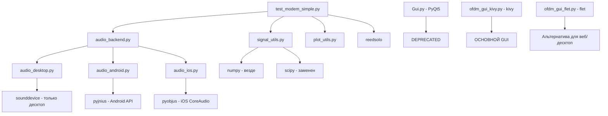

# План кроссплатформенной совместимости (macOS, Windows, Android, iOS)

## Обзор проблем

Проект использует несколько библиотек, которые создают проблемы при кроссплатформенной компиляции. Ниже приведен подробный план замены или адаптации каждой библиотеки и функции.

---

## 1. SOUNDDEVICE (PortAudio)

### Проблема
- Требует нативной библиотеки PortAudio
- На Android требует специфических NDK-библиотек
- На iOS практически не работает
- Функции: `sounddevice.InputStream`, `sounddevice.default`, `sounddevice.play/stop/rec`

### Решение: Абстрактный слой аудио

#### Создать `audio_backend.py` (уже существует, нужно расширить)

```python
# audio_backend.py - абстрактный интерфейс
import platform
from typing import Optional

class AudioBackend:
    def __init__(self):
        self.platform = platform.system().lower()
        self._backend = None
        
    def get_backend(self):
        if self._backend is None:
            if self.platform == "android":
                from audio_android import AndroidAudioBackend
                self._backend = AndroidAudioBackend()
            elif self.platform == "ios":
                from audio_ios import IOSAudioBackend
                self._backend = IOSAudioBackend()
            elif self.platform in ["darwin", "windows", "linux"]:
                from audio_desktop import DesktopAudioBackend
                self._backend = DesktopAudioBackend()
        return self._backend

# Глобальный экземпляр
audio = AudioBackend()
```

#### Реализация для платформ:

**1.1. Desktop (macOS/Windows/Linux) - `audio_desktop.py`**
```python
import sounddevice as sd
import numpy as np

class DesktopAudioBackend:
    def __init__(self):
        self.stream = None
        
    def start_stream(self, callback, samplerate=48000, channels=1, blocksize=2048):
        self.stream = sd.InputStream(
            samplerate=samplerate,
            channels=channels,
            blocksize=blocksize,
            callback=callback
        )
        self.stream.start()
    
    def play(self, data, samplerate=48000):
        sd.play(data, samplerate)
        
    def stop(self):
        if self.stream:
            self.stream.stop()
            self.stream.close()
```

**1.2. Android - `audio_android.py`**
```python
# Использовать pyjnius для доступа к Android AudioRecord/AudioTrack
from jnius import autoclass, cast

class AndroidAudioBackend:
    def __init__(self):
        # Используем Android API через pyjnius
        self.AudioRecord = autoclass('android.media.AudioRecord')
        self.AudioTrack = autoclass('android.media.AudioTrack')
        # Настройка параметров
        
    def start_stream(self, callback, samplerate=48000):
        # Реализация через Android AudioRecord
        pass
```

**1.3. iOS - `audio_ios.py`**
```python
# Для iOS потребуется использовать pyobjus или специфичный биндинг
# Либо использовать kivy.core.audio
from kivy.core.audio import SoundLoader

class IOSAudioBackend:
    def __init__(self):
        pass
    # Реализация через CoreAudio (через pyobjus)
```

### Замена в коде
В `test_modem_simple.py` заменить:
```python
# Было:
import sounddevice as sd
stream = sd.InputStream(...)

# Стало:
from audio_backend import audio
backend = audio.get_backend()
backend.start_stream(callback)
```

---

## 2. SCIPY (Тяжелая нативная библиотека)

### Проблема
- Огромное количество C/Fortran зависимостей
- Очень сложно компилировать для Android/iOS
- Функции, используемые в проекте:

#### 2.1. `scipy.signal.fftconvolve` ([`test_modem_simple.py:30`](test_modem_simple.py:30))
**Замена через numpy:**
```python
# Было:
from scipy.signal import fftconvolve
corr = fftconvolve(rx, preamble_td[::-1], mode='valid')

# Стало (numpy.fft):
import numpy as np
def fftconvolve(a, b, mode='valid'):
    n = len(a) + len(b) - 1
    nfft = 2 ** int(np.ceil(np.log2(n)))
    A = np.fft.fft(a, nfft)
    B = np.fft.fft(b, nfft)
    out = np.fft.ifft(A * B).real
    if mode == 'valid':
        return out[len(b)-1:len(a)]
    elif mode == 'same':
        return out[n//2 - len(a)//2: n//2 + len(a)//2 + 1]
    return out
```

#### 2.2. `scipy.signal.medfilt` ([`test_modem_simple.py:30`](test_modem_simple.py:30))
**Замена через numpy:**
```python
# Было:
from scipy.signal import medfilt
Hk_mag = np.clip(medfilt(np.abs(Hk_est), 5), 1/2.0, None)

# Стало (numpy + pure python):
def medfilt(x, k):
    """Simple median filter implementation"""
    assert k % 2 == 1, "k must be odd"
    y = np.zeros_like(x)
    half = k // 2
    for i in range(len(x)):
        start = max(0, i - half)
        end = min(len(x), i + half + 1)
        y[i] = np.median(x[start:end])
    return y
```

#### 2.3. `scipy.signal.correlate` ([`test_modem_simple.py:30`](test_modem_simple.py:30))
**Замена через numpy (для 1D случая):**
```python
# Было:
from scipy.signal import correlate
corr = correlate(buf, preamble_td_local, mode='valid')

# Стало:
def correlate_1d(a, b, mode='valid'):
    # Используем FFT-based correlation
    return fftconvolve(a, b[::-1], mode=mode)
```

#### 2.4. `scipy.signal.find_peaks` ([`test_modem_simple.py:30`](test_modem_simple.py:30))
**Замена (pure python + numpy):**
```python
# Было:
from scipy.signal import find_peaks
peaks, props = find_peaks(abs_corr, height=threshold, distance=len(preamble_td)//2)

# Стало:
def find_peaks(x, height=None, distance=None):
    peaks = []
    for i in range(1, len(x)-1):
        if x[i] > x[i-1] and x[i] > x[i+1]:
            if height is None or x[i] >= height:
                # Проверка distance
                if distance is None or not peaks or (i - peaks[-1]) >= distance:
                    peaks.append(i)
    return np.array(peaks), {}
```

#### 2.5. `scipy.signal.firwin` (в других файлах)
**Замена (numpy):**
```python
def firwin(numtaps, cutoff, fs=None, window='hamming'):
    """Simple FIR filter design using window method"""
    nyq = fs / 2.0 if fs else 0.5
    if isinstance(cutoff, (list, tuple)):
        cutoff = [c / nyq for c in cutoff]
    else:
        cutoff = cutoff / nyq
    # Реализация через sinc-функцию
    n = np.arange(numtaps)
    ideal = 2 * cutoff * np.sinc(2 * cutoff * (n - (numtaps-1)/2))
    # Применение окна
    if window == 'hamming':
        w = np.hamming(numtaps)
    else:
        w = np.ones(numtaps)
    return ideal * w
```

#### 2.6. `scipy.signal.filtfilt` / `scipy.signal.sosfiltfilt` (в других файлах)
**Замена (numpy, упрощенная фильтрация):**
```python
def filtfilt(b, a, x):
    """Simple forward-backward filtering (approximation)"""
    # Простая реализация через convolve
    y = np.convolve(x, b, mode='same')
    y = np.convolve(y[::-1], b, mode='same')[::-1]
    return y
```

#### 2.7. `scipy.signal.butter` (в других файлах)
**Замена (pure python, упрощенно):**
```python
def butter(N, Wn, btype='low', fs=None):
    """Simple Butterworth filter design (returns b, a coefficients)"""
    # Для простых случаев можно использовать готовые коэффициенты
    # Или реализовать через bilinear transform
    # Упрощенная версия для 1-го порядка:
    if N == 1:
        wn = Wn / (fs/2) if fs else Wn
        b = [wn, 0]
        a = [1, wn-1]
        return b, a
    # Для высоких порядков нужна полная реализация
    raise NotImplementedError("High-order Butterworth not implemented")
```

#### 2.8. `scipy.signal.freqz` (в других файлах)
**Замена (numpy):**
```python
def freqz(b, a, worN=512, fs=2*np.pi):
    """Frequency response of digital filter"""
    w = np.linspace(0, np.pi, worN)
    h = np.zeros(w.shape, dtype=complex)
    for i, w0 in enumerate(w):
        z = np.exp(-1j * w0)
        num = np.sum(b * z ** np.arange(len(b)))
        den = np.sum(a * z ** np.arange(len(a)))
        h[i] = num / den
    w = w / np.pi * (fs / 2) if fs != 2*np.pi else w
    return w, h
```

#### 2.9. `scipy.io.wavfile.read/write` ([`test_modem_simple.py:31`](test_modem_simple.py:31))
**Замена (стандартная библиотека wave + numpy):**
```python
# Было:
from scipy.io import wavfile
_, wavd = wavfile.read(wav_path)

# Стало:
import wave
import numpy as np

def wavfile_read(filename):
    with wave.open(filename, 'rb') as wav:
        params = wav.getparams()
        frames = wav.readframes(params.nframes)
        data = np.frombuffer(frames, dtype=np.int16)
        if params.nchannels > 1:
            data = data.reshape(-1, params.nchannels)
    return params.framerate, data

def wavfile_write(filename, rate, data):
    # Нормализация данных
    if data.dtype != np.int16:
        max_val = np.max(np.abs(data))
        if max_val > 0:
            data = (data / max_val * 32767).astype(np.int16)
        else:
            data = data.astype(np.int16)
    with wave.open(filename, 'wb') as wav:
        wav.setparams((1, 2, rate, len(data), 'NONE', 'not compressed'))
        wav.writeframes(data.tobytes())
```

### Создание модуля `signal_utils.py`
Объединить все замены scipy.signal в один файл:
```python
# signal_utils.py
import numpy as np

def fftconvolve(a, b, mode='valid'):
    # ... реализация выше

def medfilt(x, k):
    # ... реализация выше

def correlate(a, b, mode='valid'):
    # ... реализация выше

def find_peaks(x, height=None, distance=None):
    # ... реализация выше

# И т.д. для остальных функций
```

---

## 3. MATPLOTLIB (Тяжелая графическая библиотека)

### Проблема
- Очень большая библиотека (~30MB)
- Требует GUI бэкенды на десктопе
- На мобильных платформах проблематична

### Решение: Условный импорт и замена

#### 3.1. Использовать бэкенд "Agg" для сохранения в файл (уже сделано)
```python
# В test_modem_simple.py:32-35
import matplotlib
matplotlib.use("Agg")  # Не-GUI бэкенд
import matplotlib.pyplot as plt
```

#### 3.2. Создать `plot_utils.py` (уже создан)
Текущая реализация в [`plot_utils.py`](plot_utils.py) уже корректна.

#### 3.3. Для мобильных платформ - отключить графики
```python
# В plot_utils.py добавить:
import platform

def plot_constellation(symb, title="Constellation"):
    if platform.system() in ["Android", "iOS"]:
        # На мобильных просто сохраняем данные, не рисуем
        np.save("constellation_data.npy", symb)
        return
    # Остальной код графика...
```

#### 3.4. Альтернатива для мобильных - использовать kivy.graphics
Для отображения графиков на мобильных можно использовать `kivy.graphics` или `matplotlib` с бэкендом `Agg` и сохранением PNG.

---

## 4. PYCRYPTODOME (нативные расширения)

### Проблема
- Требует компиляции C-кода
- Функции: `Crypto.Cipher.AES`, `Crypto.Util.Padding.pad/unpad`

### Решение: Использовать pure python реализацию или стандартную библиотеку

#### 4.1. Замена AES на pure python
```python
# Было (в rx_encoder.py:1-4):
from Crypto.Cipher import AES
from Crypto.Util.Padding import pad, unpad

# Стало: использовать cryptography (более портабельная) или pure python
try:
    # Пытаемся использовать cryptography (есть под Android)
    from cryptography.hazmat.primitives.ciphers import Cipher, algorithms, modes
    from cryptography.hazmat.backends import default_backend
    
    def aes_encrypt(key, data):
        cipher = Cipher(algorithms.AES(key), modes.ECB(), backend=default_backend())
        encryptor = cipher.encryptor()
        return encryptor.update(data) + encryptor.finalize()
        
except ImportError:
    # Fallback на pure python AES (медленнее, но работает везде)
    # Можно использовать pyAES или собственную реализацию
    import pyaes  # pure python AES
    
    def aes_encrypt(key, data):
        aes = pyaes.AESModeOfOperationECB(key)
        return aes.encrypt(data)
```

#### 4.2. Замена hashlib (стандартная библиотека, проблем быть не должно)
`hashlib` - это стандартная библиотека Python, должна работать везде.

---

## 5. PYQT5 (Только для десктопа)

### Проблема
- Работает только на десктопе (Windows, macOS, Linux)
- Не портируется на мобильные

### Решение: Использовать kivy или flet для кроссплатформенности

#### 5.1. Текущее состояние
В проекте есть:
- `Gui.py` - использует PyQt5
- `ofdm_gui_kivy.py` - использует kivy
- `ofdm_gui_flet.py` - использует flet

#### 5.2. Рекомендация
**Использовать kivy как основной GUI фреймворк**, так как:
- Официально поддерживает Android и iOS
- Есть в buildozer.spec
- Уже частично реализован

**План миграции с PyQt5:**
1. Перенести весь функционал из `Gui.py` в `ofdm_gui_kivy.py`
2. Удалить `Gui.py` или пометить как deprecated
3. Для десктопа kivy тоже работает

---

## 6. PYJNIUS (Только для Android)

### Проблема
- Специфично для Android
- Используется в `android_permissions.py`

### Решение: Условный импорт
```python
# В android_permissions.py
import platform

if platform.system() == "Android":
    from jnius import autoclass, cast
    from android.permissions import Permission, request_permissions, check_permission
    
    def request_mic_permission():
        request_permissions([Permission.RECORD_AUDIO])
else:
    # Заглушка для других платформ
    def request_mic_permission():
        pass
```

---

## 7. SOUNDFILE (libsndfile)

### Проблема
- Требует libsndfile
- Используется в тестовых файлах

### Решение: Заменить на стандартный `wave` (как в п. 2.9)
Или использовать `scipy.io.wavfile` (если scipy остается на десктопе).

---

## 8. NUMPY (Относительно безопасно)

### Статус
- Обычно хорошо портируется
- Есть в buildozer.spec
- Проблем быть не должно, если версия совместима

### Рекомендация
- Использовать numpy везде, где возможно
- Избегать специфичных для платформ функций

---

## 9. REEDSOLO (Чистый Python)

### Статус
- Pure python библиотека
- Проблем с компиляцией быть не должно
- Используется: `RSCodec`, `rs.encode()`, `rs.decode()`

### Рекомендация
- Добавить в buildozer.spec: `requirements = ..., reedsolo`
- Добавить в requirements.txt

---

## 10. KIVY (Мобильные платформы)

### Статус
- Специально для мобильных
- Есть в buildozer.spec
- Проблем быть не должно

### Рекомендация
- Использовать как основной GUI
- Проверить версию в buildozer.spec (сейчас 2.1.0)

---

## 11. FLET (Веб/Десктоп)

### Статус
- Хорошо работает на десктопе и вебе
- Плохо поддерживает мобильные (хотя есть экспериментальная поддержка)

### Рекомендация
- Использовать как альтернативу для веб/десктопа
- Не использовать для Android/iOS сборки

---

## ПЛАН ДЕЙСТВИЙ (ПО ЭТАПАМ)

### Этап 1: Создание абстрактных интерфейсов
1. Создать `signal_utils.py` с заменой всех функций scipy.signal
2. Расширить `audio_backend.py` для поддержки платформ
3. Создать `audio_android.py`, `audio_ios.py`, `audio_desktop.py`

### Этап 2: Рефакторинг test_modem_simple.py
1. Заменить `from scipy.signal import ...` на `from signal_utils import ...`
2. Заменить `from scipy.io import wavfile` на локальную реализацию
3. Обернуть `import sounddevice` в абстрактный слой

### Этап 3: Обновление GUI
1. Перенести функционал из `Gui.py` (PyQt5) в `ofdm_gui_kivy.py`
2. Удалить или пометить как deprecated `Gui.py`
3. Проверить, что `ofdm_gui_flet.py` работает корректно

### Этап 4: Обновление конфигурационных файлов
1. Обновить `buildozer.spec`:
```
requirements = python3,kivy,numpy,pyjnius,pillow,reedsolo,pycryptodome
# Убрать scipy, sounddevice, matplotlib
```
2. Обновить `requirements.txt`:
```
kivy
numpy
reedsolo
pycryptodome
# Убрать scipy, sounddevice, matplotlib (для десктопа можно оставить)
```

### Этап 5: Тестирование
1. macOS: `python test_modem_simple.py`
2. Windows: тестирование в Windows среде
3. Android: `buildozer -v android debug`
4. iOS: `buildozer -v ios debug` (требует macOS)

---

## MERMAID ДИАГРАММА



---

## ИТОГОВЫЙ СПИСОК ФАЙЛОВ ДЛЯ СОЗДАНИЯ/ИЗМЕНЕНИЯ

### Создать:
1. `signal_utils.py` - замена scipy.signal
2. `audio_desktop.py` - аудио для десктопа
3. `audio_android.py` - аудио для Android
4. `audio_ios.py` - аудио для iOS
5. `wav_utils.py` - замена scipy.io.wavfile

### Изменить:
1. `test_modem_simple.py` - заменить импорты
2. `audio_backend.py` - расширить функционал
3. `plot_utils.py` - добавить проверку платформы
4. `buildozer.spec` - обновить requirements
5. `requirements.txt` - обновить зависимости
6. `ofdm_gui_kivy.py` - добавить функционал из Gui.py

### Удалить/Deprecate:
1. `Gui.py` - перенести функционал в kivy версию
2. Все файлы с "копия" в названии (мусор)

---

## ПРИМЕР СТРУКТУРЫ ПРОЕКТА ПОСЛЕ РЕФАКТОРИНГА

```
Acoustic_Modem/
├── core/
│   ├── test_modem_simple.py
│   ├── signal_utils.py
│   ├── wav_utils.py
│   └── plot_utils.py
├── audio/
│   ├── audio_backend.py
│   ├── audio_desktop.py
│   ├── audio_android.py
│   └── audio_ios.py
├── gui/
│   ├── ofdm_gui_kivy.py (основной)
│   └── ofdm_gui_flet.py (альтернатива)
├── utils/
│   ├── android_permissions.py
│   └── reedsolo_wrapper.py
├── buildozer.spec
├── requirements.txt
└── plans/
    └── cross_platform_compatibility_plan.md
```
